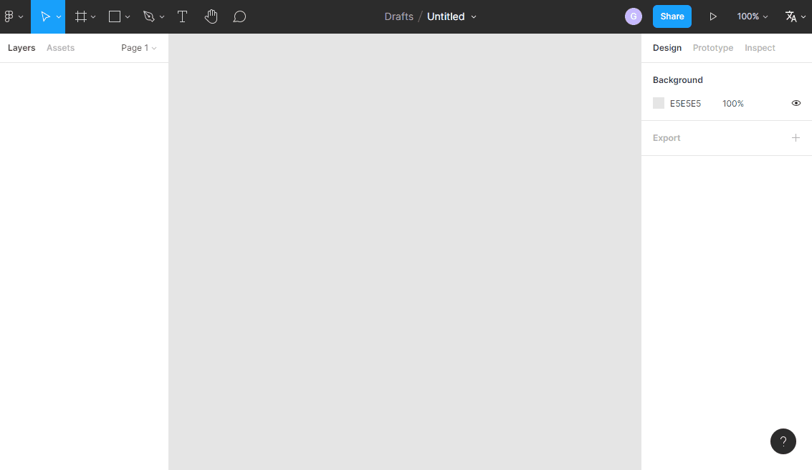

  
   
  强大、智能并且简单易用的 Figma 国际化脚本
   
   
  
  
  
   
   
  <a href="./README.md">English</a> | 中文

### 💽 脚本安装

1. 安装 Figma I18n 脚本之前请确认浏览器是否已安装脚本管理器，如果没有则点击下方链接任选一个进行安装即可
   
   * [Tampermonkey（油猴，推荐）](https://www.tampermonkey.net/)
   * [Violentmonkey（暴力猴）](https://violentmonkey.github.io/get-it/)
  
2. 点击下方链接，通过 [GreasyFork](https://greasyfork.org/zh-CN) 安装用户脚本
   
   [Figma I18n：点击我安装脚本！！！](https://greasyfork.org/zh-CN/scripts/440348-figma-i18n)

### 📚 脚本特性

* 简单易用：无需额外安装插件且支持手动进行语言切换，无需频繁关闭/启用插件
* 多语言支持：支持英文、简体中文切换，繁体中文以及其它语言将会逐步支持
* 智能切换主题：操作菜单支持根据操作页面自动切换主题
* 精准的语言转换：精准识别所有需要进行语言转换的DOM节点，解决通过字符串匹配导致翻译不准确的问题
* 优秀的转换效率：充分复用已有节点，最大程度减少每次操作节点的次数，大幅度提高转换效率
  
### 📺 功能演示

### ❤️ 捐赠作者

### 📄 开源许可证

[Apache License](https://github.com/NICEXAI/figma-i18n/blob/main/LICENSE) © 2022-PRESENT [Afeyer](https://github.com/NICEXAI)